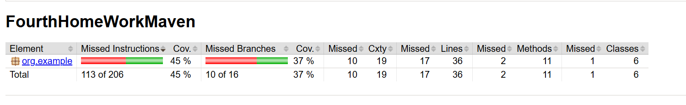

Указанный проект инициализирует список пользователей с указанием id, ФИ, роли.
Проект обрабатывает список пользователей с помощью объекта formatter, который на текущий момент может обрабатывать список только в строку.
Согласно реализованному SOLID в данном проекте, если захочется обрабатывать список по-другому, то это будет легко добавить (например в JSON).
Программа выводит список всех пользователей в обработанном виде, а также выводит список всех администраторов.

В данном домашнем задании добавил pom.xml в проект, добавил необходимые зависимости для тестов.
Тесты запускаются с помощью жизненного цикла Maven.

В качестве плагина я выбрал jacoco. Добавил его в pom.xml.
После выполнения жизненного цикла Maven, включая test, в проекте генерируется target, 
в котором есть index.html. Указанную HTML страницу можно открыть и увидеть сколько строчек кода покрыто тестами.
Считаю, что данный плагин очень полезен.

